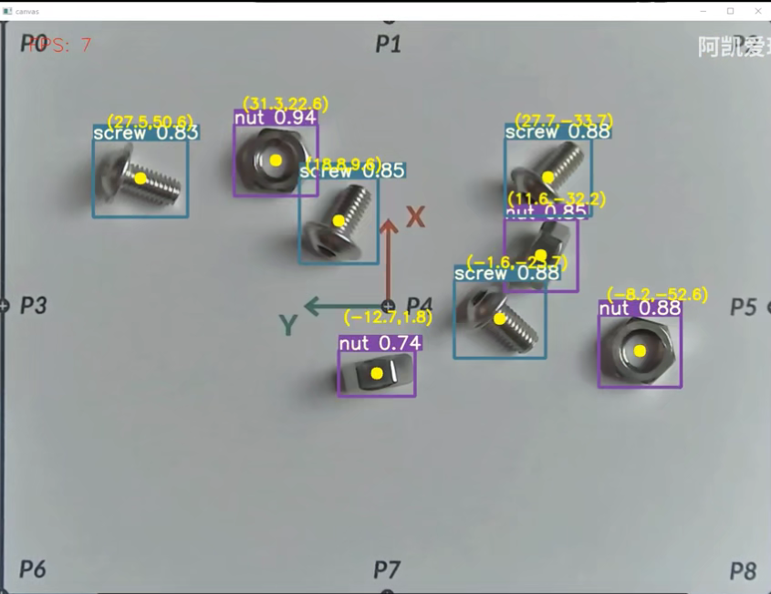

# YoloV5模型简化部署(yolov5-simple)
[toc]

## yolov5-simple是做啥的？


YoloV5 的工程包含很多内容，例如模型训练、模型评估、模型测试以及可视化相关的内容。在部署的时候只需要用到YoloV5中的模型推理相关的内容，其他的依赖用不到。另外YoloV5目标检测的代码，过于冗杂，需要进行裁剪。 因此阿凯帮大家开发了一个简易版本的YoloV5的库 `yolov5-simple` ,  用最简单的方式来调用YoloV5目标检测模型。




效果视频: [Mirobot螺丝螺母分拣-深度学习机械臂抓取-YoloV5目标检测](https://www.bilibili.com/video/BV1RP4y1V76Q?spm_id_from=333.999.0.0)

## 配置YoloV5模型

将`yolov5/runs` 里训练得到的模型文件重命名， 例如`nut_and_screw_yolov5n.pt`

然后将模型文件放置到`yolov5_simple/weights/`中。 

修改模型配置文件

`config/yolov5.yaml`

```yaml
####################################
## YoloV5模型卡片识别20类 配置文件
####################################
# YoloV5模型权重路径
weight:  "weights/nut_and_screw_yolov5n.pt"
# 输入图像的尺寸
input_size: 640
# 类别个数
class_num:  2
# 标签名称
class_name:  ["nut", "screw"]
# 标签类的中文名称
class_name_cn: ["螺母", "螺丝"]
# 阈值设置
threshold:
  iou: 0.8
  confidence: 0.6
# 计算设备
# - cpu
# - 0 <- 使用GPU
device: 'cpu'
```


## 配置相机参数

修改配置文件`config/camera.yaml`

```yaml
#############################
## 相机的默认参数
#############################
# 摄像头的设备号
# 默认为 0:  /dev/video0
device: 0  
# 画面宽度
img_width: 1920
# 画面高度 
img_height: 1080
# 相机帧率
fps: 30
# 图像缓冲区的尺寸
buffer_size: 2
```

## 执行脚本

执行YoloV5的实验脚本

```
python yolov5.py
```


## API使用说明

创建模型

```python
# YOLOV5模型配置文件(YAML格式)的路径 yolov5_yaml_path
model = YoloV5(yolov5_yaml_path='config/yolov5.yaml')
```

目标检测

```python
# YoloV5 目标检测
canvas, class_id_list, xyxy_list, conf_list  = model.detect(img)
```

* `canvas` : 画布

  在原图的基础上绘制矩形框，类别，置信度。

* `class_id_list`:   检测到的类别ID列表

* `xyxy_list`: 检测到物体矩形框的列表

  矩形框的格式为$[x_1, y_1, x_2, y_2]$ , 其中$(x_1, y_1)$ 是矩形框左上角的点坐标， $(x_2, y_2)$ 是右下角的坐标。  

  求解物体矩形框中心点的坐标的公式为:
  $$
  cx = \frac{x_1 + x_2}{2}
  $$

  $$
  cy = \frac{y_1 + y_2}{2}
  $$

* `conf_list`: 置信度列表


## 联系阿凯

作者: 阿凯爱玩机器人

微信: xingshunkai | QQ：244561792 | 邮箱: xingshunkai@qq.com

